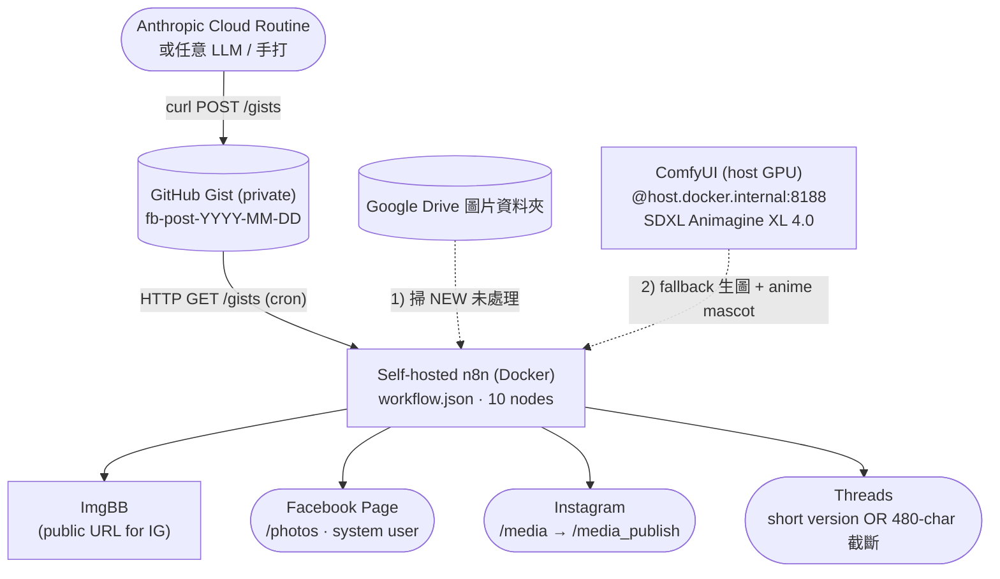

# n8n Content Orchestrator (v4 + ComfyUI)

> Cron-based 內容發布管線：從 GitHub Gist 拉草稿 → 取/生圖 → 一次扇出 FB Page + Instagram + Threads。

**Author**: [@Lee-unhn](https://github.com/Lee-unhn) · a2264563@gmail.com

## 專案簡介 / Overview

n8n Content Orchestrator 解決「雲端 AI routine 能排程產生內容、卻無法直接呼到你的機器或第三方平台發布」這個結構性問題。設計上以 **GitHub Gist 當異步、永久線上的中介層**：雲端 routine（Anthropic Code Routines / GitHub Actions / 本機 LLM / 手打）寫入 private Gist，自架 n8n 依排程讀取、解析圖片來源、上傳 ImgBB，再扇出三個 Meta 平台。內容產製端與發布端互不知情，任一層皆可獨立替換。

**Status**: text + image branches shipped to 3 platforms. Video branch is out of scope.

**v4 changelog (2026-06-08)**：
- 🔥 Pollinations.ai 2026-06 變付費 → 改成本機 **ComfyUI server + Animagine XL 4.0**（SDXL anime checkpoint，免費、本機 GPU、~13s/image after warmup）
- 🆕 Threads 短版（cloud routine 在 frontmatter 寫 `post_text_threads`，n8n 優先用短版而非截斷長版）
- 🆕 AI 標註：當 `image_source` 開頭 `comfyui` 或 `pollinations.ai`，FB/IG/Threads 自動加「（圖片 AI 生成）」
- 🆕 ▋ section-aware fallback 截斷（若 cloud routine 沒寫短版時用）

## 架構 / Architecture



## 技術棧 / Tech Stack

- Docker / Docker Compose v2.20+
- n8n（自架，port 5678，16 個 env-var 注入）
- GitHub Gist API（cloud-to-cloud 異步橋接）
- Google Drive API（圖片來源優先）
- **ComfyUI**（本機 SDXL anime 生圖，取代 Pollinations.ai）
- ImgBB（圖片轉公開 URL，IG 需要）
- Meta Graph API：FB Page system user token、Instagram `/media`+`/media_publish`、Threads `/threads_publish`

## ComfyUI quickstart (v4 image-gen)

1. 下載 ComfyUI portable：https://github.com/Comfy-Org/ComfyUI/releases
2. 把 SDXL anime checkpoint（推薦 [Animagine XL 4.0](https://huggingface.co/cagliostrolab/animagine-xl-4.0)）丟進 `ComfyUI/models/checkpoints/`
3. 啟動：`python_embeded\python.exe -s ComfyUI\main.py --listen 0.0.0.0 --port 8188`
4. Docker n8n 透過 `host.docker.internal:8188` 連到 host
5. 完整 patch（Resolve Image node code、AI disclosure tag、ComfyUI workflow JSON）詳見 [comfyui-integration.md](comfyui-integration.md)

**硬體驗證**：GeForce RTX 3060 12GB VRAM、Windows 11、Animagine XL 4.0（6.6 GB）。首次生圖 ~140s（model warmup），之後每張 ~13s。

## 主要檔案 / Key Files

- `docker-compose.yml` — 把 n8n 跑在 port 5678，含 timezone + env-var 注入
- `workflow.json` — 10 個節點的 n8n workflow（text + image 兩個分支、三個平台）
- `comfyui-integration.md` — ComfyUI 接入步驟、Resolve Image 全段 code、AI 標註邏輯
- `cloud_routine_patch.md` — 貼到 Anthropic cloud routine prompt 的 snippet
- `.env.example` — 所有密鑰的模板（含 ComfyUI 變數）
- `.gitignore` — 把 secrets / 容器資料 / 編輯器產物擋在 git 外

**Not included**（intentional）：
- 品牌專屬語氣 / 公式 / style — 那些活在你的 cloud routine prompt，不在本 orchestrator
- Video publishing branch — 另一個 phase
- 任何生產用 token — repo 內全部是 placeholder

## 使用 / Usage

### Prerequisites

- Docker Desktop（或 Docker Engine + Compose v2.20+）
- GitHub 帳號（做 Gist 中介）
- 一個你有 admin 權限的 Facebook Page（在 Meta Business Portfolio 內）
- NVIDIA GPU（12GB+ VRAM 跑 SDXL 順）— for ComfyUI 本機生圖
- 一個依排程產內容的方式（cloud routine / 本機 LLM / 手打）

### Quickstart

```bash
# 1. 複製 .env 並填入密鑰
cp .env.example .env
# 編輯 .env：GitHub PAT、Meta system user token、ImgBB key、ComfyUI URL…

# 2. 起 n8n
docker compose up -d

# 3. 起 ComfyUI（host 上跑）
cd ComfyUI_windows_portable
python_embeded\python.exe -s ComfyUI\main.py --listen 0.0.0.0 --port 8188

# 4. 開 http://localhost:5678 → Import workflow.json → Publish (activate)

# 5. 把 cloud_routine_patch.md 兩段 snippet 貼到你的 cloud routine prompt
```

詳細步驟參考 `comfyui-integration.md` 與 `cloud_routine_patch.md`。

## License

MIT — 詳見 [`LICENSE`](LICENSE)。
